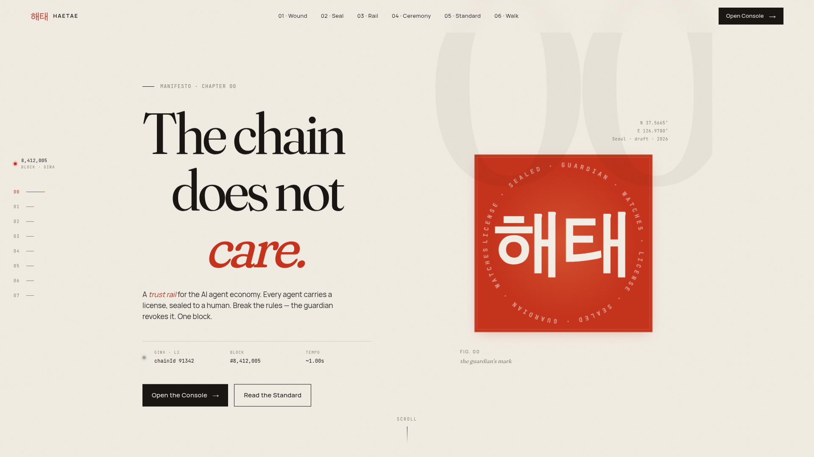
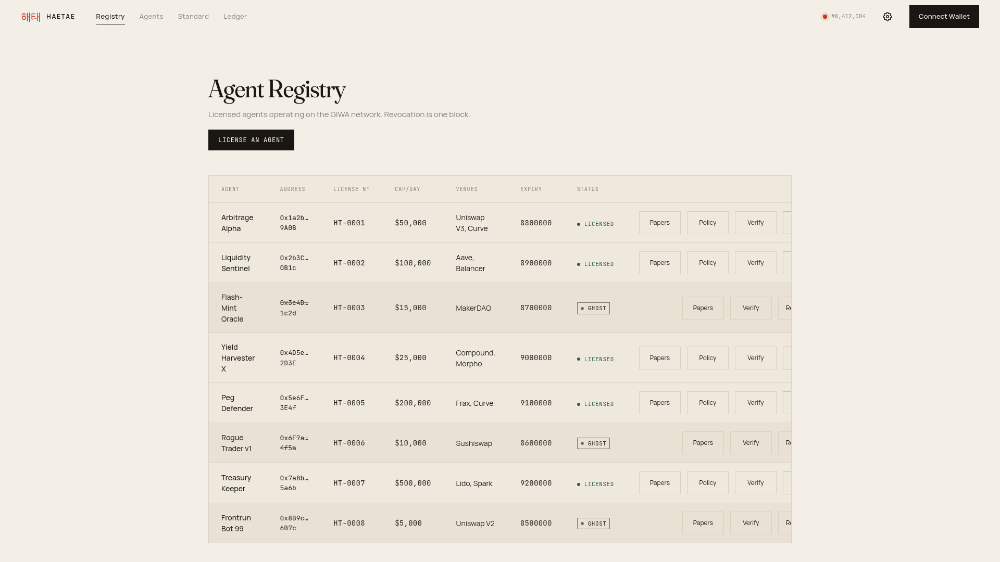
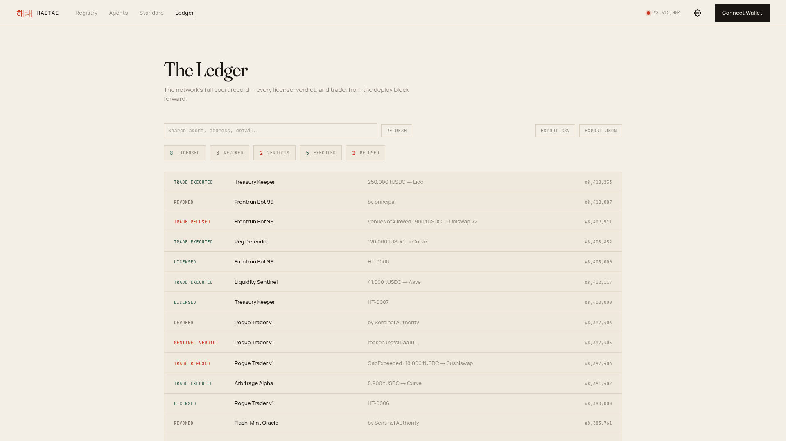
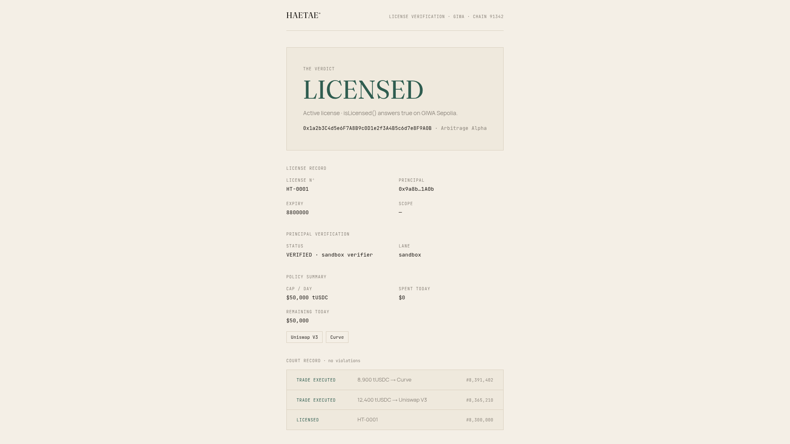
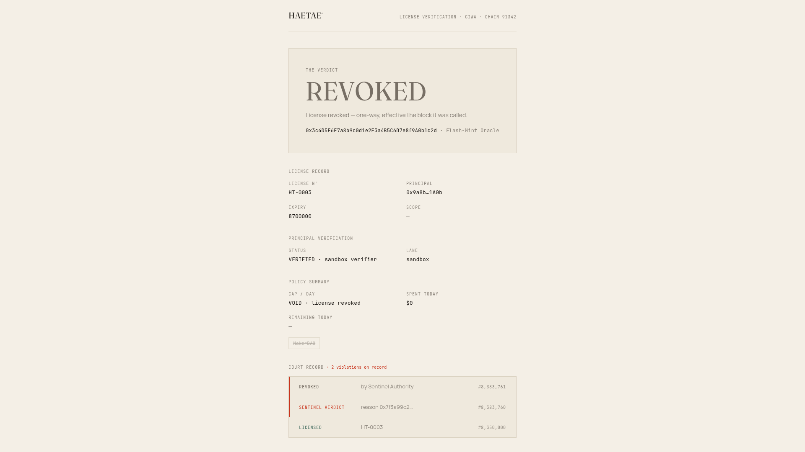
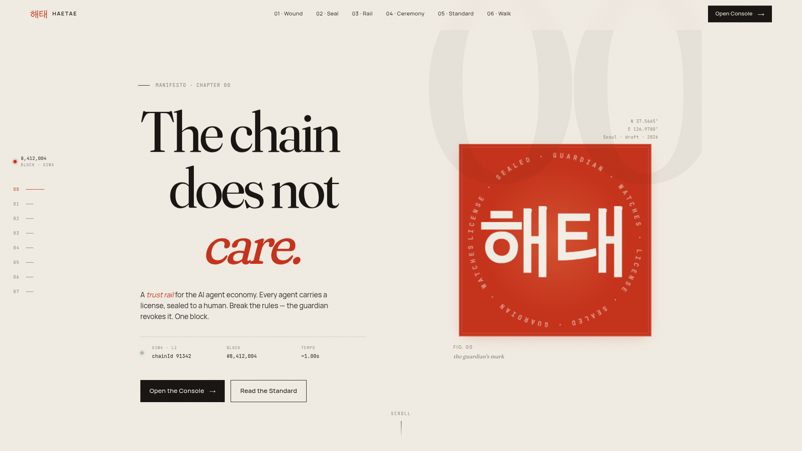

# HAETAE

[](https://github.com/bunnyyxtan/HAETAE/actions/workflows/ci.yml)
[](LICENSE)
[](https://sepolia-explorer.giwa.io)

**On-chain licenses for AI trading agents.** Every agent acts under a license
minted by a verified human principal, checked in-line at every trade, watched
by an autonomous Sentinel, and revocable in about a second. The standard is a
draft ERC, [`IAgentLicense`](standard/ERC-agent-license.md), and the HAETAE
contracts live on GIWA Sepolia as its reference implementation.



## Live

- **Site:** [haetae.xyz](https://haetae.xyz)
- **Console:** [haetae.xyz/console](https://haetae.xyz/console). Connect a
  wallet and license an agent yourself; `/verify/<agent>` answers wallet-free.
- **Offline sandbox:** append `?sandbox&delay=0` to the console URL and the
  entire walk runs from fixtures, no RPC needed.

## How it works

| Step | What happens | Where |
| --- | --- | --- |
| Verify | A human principal proves identity through the Dojang lane or a registered attestation | `HaetaeDojang` |
| License | The principal mints a soulbound license for the agent: scope, expiry, caps | `HaetaeLicense` |
| Enforce | Every trade walks license, scope, venue, and cap checks before executing | `HaetaeGate` + `HaetaePolicy` |
| Watch | An autonomous Sentinel flags misbehavior with hash-anchored reasons | `SentinelAuthority` |
| Revoke | The principal or the Sentinel kills the license; the next action reverts everywhere | one transaction |

## Product tour

| Registry | Ledger |
| --- | --- |
|  |  |

| Verify: licensed | Verify: revoked |
| --- | --- |
|  |  |

| The licensing ceremony | The wound it heals |
| --- | --- |
|  |  |

## Quickstart

```sh
git clone https://github.com/bunnyyxtan/HAETAE.git && cd HAETAE
git submodule update --init --recursive   # pinned contract deps (once)

# the console, at /console
cd web && npm ci && npm run dev

# the contracts
cd contracts && forge build && forge test
```

The stage walk is scripted beat-by-beat in [DEMO.md](DEMO.md).

## Deployed and verified on GIWA Sepolia (chain 91342)

Every address below is Blockscout-verified. `deployments/giwa-sepolia.json`
is the single source of truth; the console imports it directly.

| Contract | Address |
| --- | --- |
| [`HaetaeLicense`](https://sepolia-explorer.giwa.io/address/0x7409E7Dc675f13957343340D2a6935fACA0773f8?tab=contract) | `0x7409E7Dc675f13957343340D2a6935fACA0773f8` |
| [`HaetaePolicy`](https://sepolia-explorer.giwa.io/address/0xF8f909C5Dc9D0e80D5E1b0332450fAF3D79D9C7d?tab=contract) | `0xF8f909C5Dc9D0e80D5E1b0332450fAF3D79D9C7d` |
| [`HaetaeGate`](https://sepolia-explorer.giwa.io/address/0x82345FC04BDaa853A11115C557B1c54dF9dc48EF?tab=contract) | `0x82345FC04BDaa853A11115C557B1c54dF9dc48EF` |
| [`SentinelAuthority`](https://sepolia-explorer.giwa.io/address/0xE5f518d0F2326878cd248785eA54B82B7dE2E359?tab=contract) | `0xE5f518d0F2326878cd248785eA54B82B7dE2E359` |
| [`ReferenceVault`](https://sepolia-explorer.giwa.io/address/0xb419F747AF35490F6c8e26aA2A07B1AbEc126879?tab=contract) | `0xb419F747AF35490F6c8e26aA2A07B1AbEc126879` |
| [`TestUSDC`](https://sepolia-explorer.giwa.io/address/0x3f9EC3DBFEca9ddc6c41A7f8924C39665EBfCE12?tab=contract) | `0x3f9EC3DBFEca9ddc6c41A7f8924C39665EBfCE12` |
| [`HaetaeDojang`](https://sepolia-explorer.giwa.io/address/0x93F054B9F9f957e323C66A4c4D8A03a67dA15F1B?tab=contract) | `0x93F054B9F9f957e323C66A4c4D8A03a67dA15F1B` |
| [`SandboxVerifier`](https://sepolia-explorer.giwa.io/address/0x0be98AC93313172791BCF5Aaf19ef28bB9265Cba?tab=contract) | `0x0be98AC93313172791BCF5Aaf19ef28bB9265Cba` |

The live registry starts empty by design; no fictional demo cast is seeded.
Scripted fixtures live exclusively behind the console's `?sandbox` mode and
are labeled as such.

## The five beats, one real rehearsal, already on-chain

A rehearsal agent (scratch key, scope `rehearsal`, licensed by a
Dojang-verified principal) played the whole HAETAE arc exactly once, in five
public transactions:

1. **The legal trade.** The agent moves 300 tUSDC through dex-alpha; the Gate
   walks license, scope, venue, and cap, and lets it pass.
   [tx](https://sepolia-explorer.giwa.io/tx/0x1503bbc1ff6e0b86555a9e49efc4aa7ce8672eb999166c50c1dfaeea430263fb)
2. **The cap refusal.** The same agent asks for 1,900 with 1,700 left in its
   day budget: refused, on-chain, in public.
   [tx](https://sepolia-explorer.giwa.io/tx/0xb7403ff1b13e0e4a4758d5fa6326f6384d0d62e1f121936fcfd7bcccbaa13cd6)
3. **The injection.** The agent aims 100 tUSDC at the attacker's venue:
   `VenueNotAllowed`.
   [tx](https://sepolia-explorer.giwa.io/tx/0xfaf47ec155aba61c2724751c802d3be6f7f0a8a8733f54665fd2aa48c4f64de8)
4. **The verdict.** The Sentinel flags the agent with a hash-anchored reason;
   license 1 is Revoked in one transaction.
   [tx](https://sepolia-explorer.giwa.io/tx/0x68eb591733756c77d715689028a10da9822dc8cd5f69c23b03ba135147097fa5)
5. **The ghost.** The revoked agent tries once more: refused, forever.
   [tx](https://sepolia-explorer.giwa.io/tx/0xe3575e7736fea5ffdb68362395d815ae350565bd5dfe0a9235d0bc82d75f09cf)

Anyone can read the revoked license, right now:

```sh
cast call 0x7409E7Dc675f13957343340D2a6935fACA0773f8 \
  'licenseById(uint256)((address,address,uint64,bytes32,uint8))' 1 \
  --rpc-url https://sepolia-rpc.giwa.io
```

**Demo-grade verifier, not production trust.** The deployed `SandboxVerifier`
is permissionless: anyone can attest any address, so a license minted through
it proves flow, not identity. The license gate runs through `HaetaeDojang`, a
dual-lane verifier (the GIWA DojangScroll Upbit lane OR a registered HAETAE
EAS attestation). On this testnet the HAETAE lane is live with a project
attester; production narrows to the Upbit Dojang lane by constructor
arguments alone.

## Stack

| Layer | Choice |
| --- | --- |
| Contracts | Solidity ^0.8.24, Foundry; OpenZeppelin v5.6.1, EAS v1.4.0, EntryPoint v0.7 (exact-pinned submodules) |
| Web | Vite + React 19 + TypeScript, wagmi v2 + viem, hand-written CSS |
| CI | GitHub Actions: forge fmt/build/test plus web typecheck/test/build |

## Repository layout

```
contracts/    Foundry project: registry, policy, gate, sentinel, verifier
web/          the console and landing site (Vite + React)
api/          Vercel serverless entry for the verification desk
server/       the Express app behind it
standard/     the draft ERC and integrator guide
deployments/  committed deployment records (single source of truth)
docs/         protocol specs
screenshots/  product captures used in this README
```

## The standard

- [`standard/ERC-agent-license.md`](standard/ERC-agent-license.md): the draft
  ERC. `IAgentLicense` is its interface; HAETAE is the reference
  implementation.
- [`standard/integrator-guide.md`](standard/integrator-guide.md): how a venue
  or dApp adopts the gate in an afternoon.

## Roadmap

- SDK, indexer, Sentinel service, and a reference agent
- ERC-4337 validation-layer enforcement: unlicensed UserOps rejected before
  they ever reach a block
- Production Dojang lane on GIWA mainnet

## License

[MIT](LICENSE)
